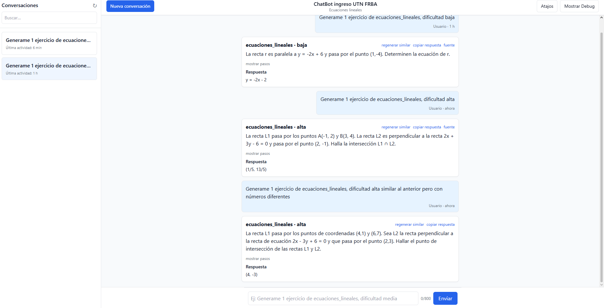
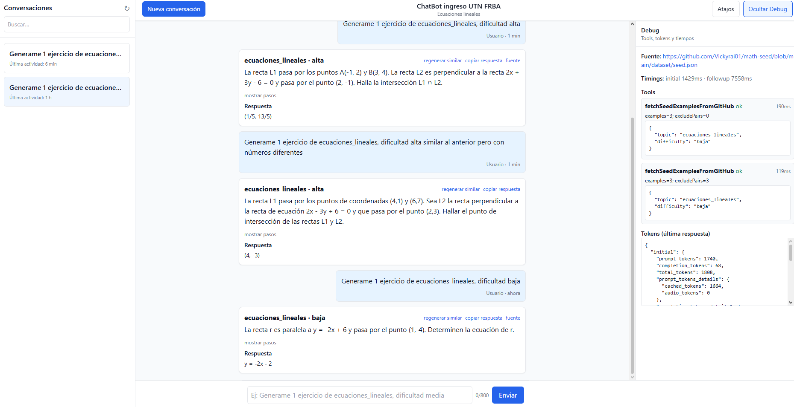
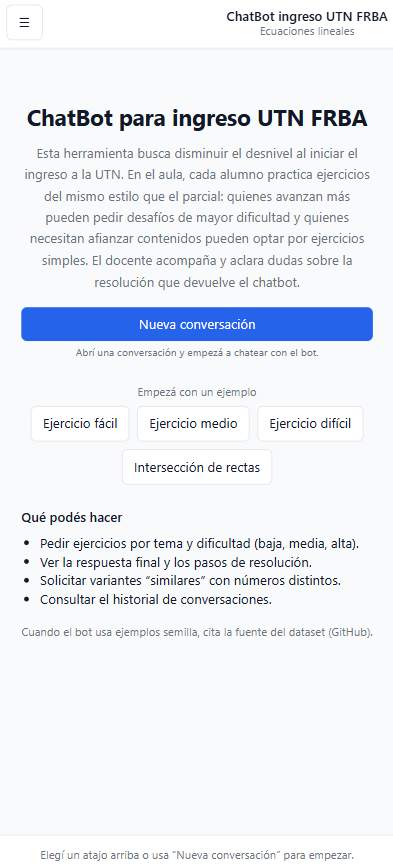

# ChatBot de ejercicios de parcial — Ingreso UTN FRBA

Descripción del proyecto
- Chatbot orientado a generar ejercicios de matemática con el mismo nivel y estilo que los parciales de ingreso de la UTN FRBA. 
- Devuelve enunciado, pasos de resolución y respuesta final en formato estructurado (JSON), citando fuente cuando utiliza el dataset semilla alojado en GitHub.
- Diseñado para uso en aula: alumnos avanzados piden ejercicios más difíciles; quienes necesitan refuerzo eligen ejercicios sencillos. El docente acompaña y aclara dudas sobre la resolución brindada por el bot.

Definición del ChatBot
- Problema que resuelve
  - Busca reducir el desnivel con el que se encuentran los alumnos al iniciar las clases en el ingreso de la UTN FRBA, ofreciendo práctica personalizada con ejercicios “estilo parcial” y retroalimentación verificable.
- Público objetivo
  - Alumnos del ingreso de UTN FRBA y docentes que buscan facilitar práctica con dificultad adaptativa.
- Propuesta de valor
  - Generación continua de ejercicios alineados al examen, con pasos y respuestas verificables; historial persistente; cita de fuente al usar dataset semilla; panel de debug para transparencia técnica.

Links de deploy
- Frontend (Vercel): https://ai-tool-calling-integration.vercel.app

Arquitectura (alto nivel)
```
Frontend (Next.js, Vercel)
   └── UI de chat, historial, bienvenida, debug sheet
        ▲
        │ HTTP (fetch con credentials; cookies HttpOnly para scoping)
        ▼
Backend (NestJS, Render/Railway)
   ├── POST /chat (OpenAI + tools, Zod, persistencia)
   └── GET /conversations, GET /conversations/:id

```

## Tecnologías principales

- **Lenguaje:** TypeScript (frontend y backend)
- **Frontend:** Next.js (React)
- **Backend:** NestJS (Node.js)
- **Base de datos:** MongoDB Atlas
- **Orquestador LLM y tools:** OpenAI SDK
- **Librerías clave:** 
  - Zod (validación de schemas)
  - mathjs (validación respuestas numéricas)
- **Testing:** Jest, Supertest
- **Control de versiones:** GitHub
- **Despliegue:** 
  - Frontend en Vercel
  - Backend en Render
- **Integración API externa:** GitHub Contents API para dataset semilla de ejercicios

---

### Decisiones y justificación del stack

- **Next.js**  
  Elegido para el frontend ya que permite desarrollo veloz con React, soporte nativo para SSR y rutas, y despliegue automático en Vercel según lo requerido en la consigna.

- **NestJS**  
  Usado para el backend por su arquitectura modular, escalabilidad y robusta integración con herramientas modernas (OpenAI, MongoDB), además de manejo sencillo de middlewares, validación y CORS.

- **MongoDB Atlas**  
  Preferido por sobre una base relacional debido a la baja complejidad de las relaciones entre entidades (conversaciones, mensajes, ejercicios), flexibilidad de modelo y facilidad de despliegue y administración. Permite almacenar documentos con schemas evolutivos y acelerar el time-to-market requerido por el challenge.

- **Render y Vercel**  
  Render elegido para el backend por facilidad de uso, builds automatizados y similitud conceptual con Vercel, plataforma obligatoria para el frontend según consigna.

- **OpenAI, Zod, mathjs, etc.**  
  OpenAI SDK es el core de la integración LLM; Zod y mathjs garantizan que los datos intercambiados sean válidos y robustos tanto en inputs como en outputs.

---
### Tools/APIs elegidas
  - Tool externa: GitHub Contents API
    - Dataset semilla versionado, auditable y de fácil acceso. Permite citar fuente y manejar rate limits de forma explícita. Es una API real distinta al LLM, cumpliendo el requisito y alineada al caso de estudio (ejercicios).
  - Tool interna: validateNumericAnswer (mathjs)
    - Verificación determinística de respuestas numéricas del alumno; aporta lógica de negocio y evita delegar todo al LLM.
- Manejo de errores y edge cases
  - Retries con backoff (429/5xx) para llamadas a OpenAI; timeouts para herramientas externas; validación con Zod de outputs del LLM y del dataset semilla; fallback a texto si el JSON no valida; logging controlado sin secretos.
- Estrategia de prompts
  - System prompt define reglas: temas/dificultad; formato JSON; pasos y respuesta; uso de tools y cita de fuente.
  - Few-shots para guiar cuándo invocar cada tool (seed/validación) y cómo devolver outputs estructurados.
- Trade-offs
  - No se implementó autenticación completa; se usa cookie HttpOnly (client_id) para scoping de conversaciones. Es suficiente para el challenge y preserva privacidad básica sin complejidad de auth.
  - Se priorizó velocidad de entrega y claridad técnica por sobre features avanzadas (SSE/RAG); ambos quedan planificados como mejora futura.

---
### Mejoras futuras planeadas
- Autenticación de usuarios y perfil docente/alumno.
- Feedback por mensaje (👍/👎), supervisión docente.
- Internacionalización y soporte para más temas.
- RAG (Retrieval Augmented Generation) con embeddings sobre el dataset semilla.
- Observabilidad avanzada: traces, métricas y panel de insights.
- Filtros y búsqueda avanzada en el historial.

---

### User Stories 

1) Como alumno  
   Quiero pedir ejercicios por tema y dificultad  
   Para practicar con el mismo nivel del parcial y mejorar mi rendimiento  
   Criterios de aceptación:
   - [ ] Al enviar “Generame N ejercicios de {tema}, dificultad {baja|media|alta}”, el bot devuelve JSON con exercises[{topic, difficulty, statement, steps[], answer, source}].
   - [ ] Si se usa el dataset semilla, se cita la fuente (URL de GitHub) en el ejercicio y/o panel de debug.
   - [ ] Se persisten la conversación y los ejercicios, y se ven al recargar.

2) Como alumno  
   Quiero validar mi respuesta numérica  
   Para confirmar si resolví correctamente  
   Criterios de aceptación:
   - [ ] Al enviar “Validá mi respuesta: {expr} frente a {expected}”, el bot usa validateNumericAnswer y responde ok/error.
   - [ ] El resultado se persiste como mensaje del asistente en la conversación.

3) Como alumno  
   Quiero ver mi historial de conversación  
   Para continuar practicando donde lo dejé  
   Criterios de aceptación:
   - [ ] La sidebar lista mis conversaciones ordenadas por “Última actividad” (lastMessageAt).
   - [ ] Al abrir una conversación, se muestra la cronología intercalada de mensajes y ejercicios (agrupados por messageId).
   - [ ] Las conversaciones se filtran por cookie HttpOnly (client_id), mostrando solo las del usuario actual.
---

### Features implementadas (bonus)
- Tool/function calling nativo (OpenAI) con decisión automática.
- JSON estructurado validado con Zod.
- Panel de debug (desktop sidebar y mobile bottom sheet) con herramientas, tokens y latencias.
- Testing: E2E de POST /chat (Jest + Supertest) y unit tests mínimos de tools.
- Accesibilidad: aria-labels en botones clave, foco visible, layout responsivo.
- Rate limiting recomendado: 30 req/5 min en /chat (snippet incluido).

---

### Instalación local (monorepo)

Requisitos:
- Node.js >= 18
- pnpm >= 8
- MongoDB Atlas (URI)
- Claves de OpenAI y variables del seed

1) Preparar variables
- Copiar ejemplos de entorno:
  - Backend: `cp apps/backend/.env.example apps/backend/.env`
  - Frontend: `cp apps/frontend/.env.example apps/frontend/.env.local`
- Completar:
  - Backend: OPENAI_API_KEY, MONGODB_URI, FRONTEND_ORIGIN, SEED_OWNER, SEED_REPO, SEED_PATH
  - Frontend: NEXT_PUBLIC_API_URL (URL del backend)

2) Instalar dependencias
- En la raíz: `pnpm install`

3) Levantar backend (NestJS)
- `pnpm -F @app/backend start:dev`
- Por defecto: `http://localhost:3001` (ajustar .env si es distinto)

4) Levantar frontend (Next.js)
- `pnpm -F @app/frontend dev`
- Visitar `http://localhost:3000`
--- 

## Capturas de pantalla

### Bienvenida en desktop


### Ejemplo de generación de ejercicios


### Panel de debug con tools y tokens


### Mobile


### Demo animada


---

### Modelos y persistencia
- conversations: { title?, userId?, lastMessagePreview?, lastMessageAt?, createdAt, updatedAt }
- messages: { conversationId, role: 'user'|'assistant'|'tool', content, metadata?, createdAt }
- exercises: { conversationId, messageId?, topic, difficulty, statement, steps, answer, sourceUrl?, createdAt }

--- 

### Endpoints principales (backend)
- POST /chat
  - Orquesta OpenAI con tools (GitHub seed, validar respuesta), persiste mensajes y ejercicios.
  - Devuelve JSON de ejercicios o texto y meta (timings, tokens, tools, sourceUrl).
- GET /conversations
  - Lista conversaciones del usuario (cookie HttpOnly client_id), ordenadas por lastMessageAt.
- GET /conversations/:id
  - Devuelve mensajes y ejercicios de la conversación (cronología intercalada por createdAt/messageId).
---

### Panel de debug (UX)
- Desktop: sidebar derecha fija con estado vacío cuando no hay datos y lista de tools/tokens/timings cuando hay respuesta.
- Mobile: bottom sheet accesible con toggle, estado vacío si aún no hay meta.

---

### Testing
- **E2E Tests**: Prueba del flujo completo de POST /chat (Jest + Supertest) con mocks de OpenAI y tool externa.
  - Correr: `pnpm -F @app/backend test:e2e`
  
- **Unit Tests**: Tests unitarios de las herramientas individuales.
  - Correr: `pnpm -F @app/backend test`
  - Cobertura:
    - `fetchSeedExamplesFromGitHub`: Valida filtrado por topic/difficulty, formato Zod y manejo de rate limit (429)
    - `validateNumericAnswer`: Verifica validación correcta de expresiones y manejo de errores

Notas finales
- Se priorizó una entrega sólida y clara en 4 días: arquitectura separada (Vercel + Render), persistencia real (Mongo Atlas), tool calling nativo, JSON estructurado y panel de debug transparente.
